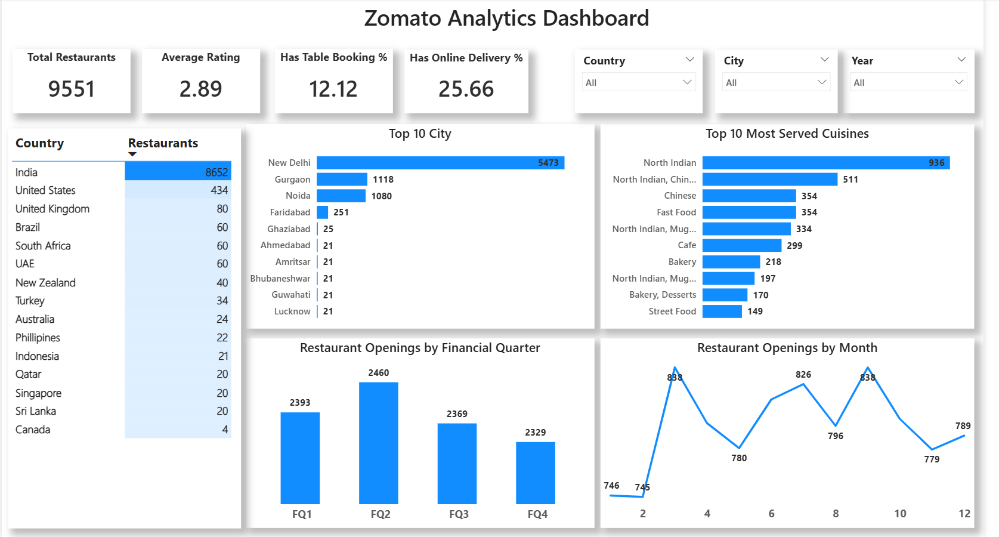
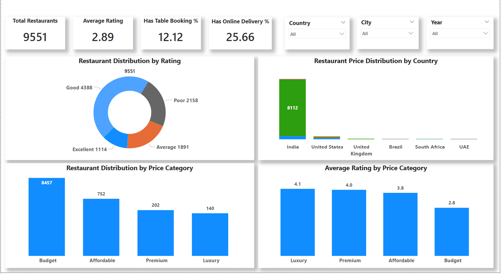
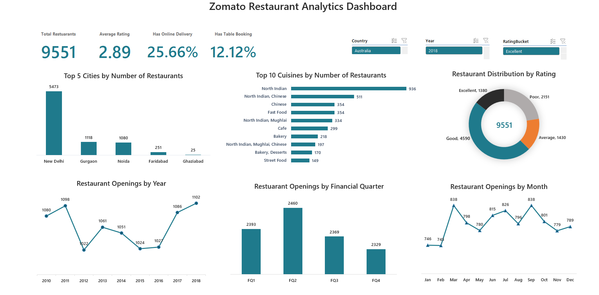
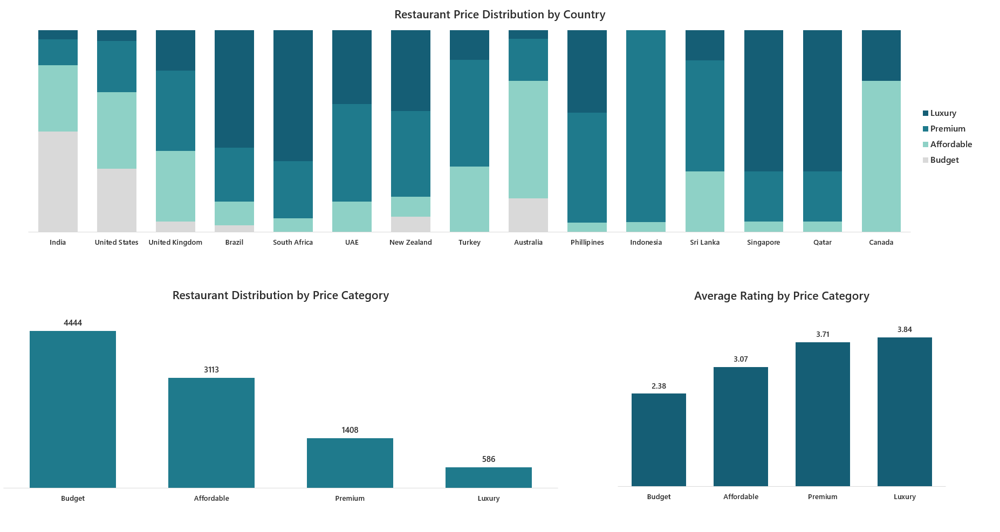
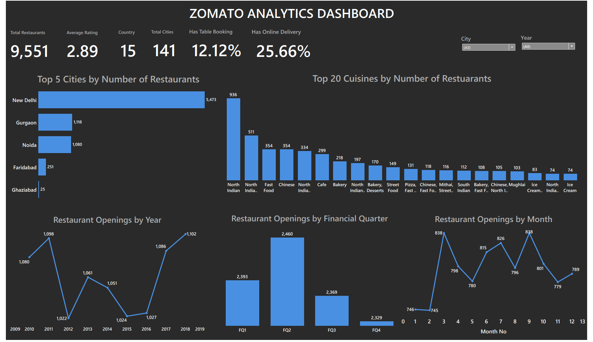
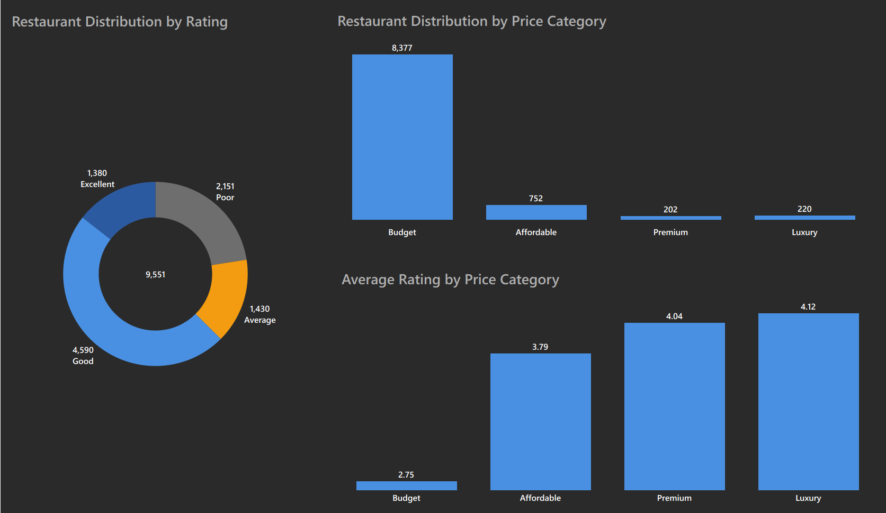

# 🍽️ Zomato Data Analysis Project

## 🚀 Project Highlights
- Performed end-to-end analysis on a real-world Zomato dataset  
- Built interactive dashboards using Power BI & Tableau  
- Extracted actionable insights on pricing, ratings, and restaurant trends  

---

## 📌 Overview
This project focuses on analyzing Zomato restaurant data to uncover insights related to pricing, customer ratings, cuisines, and geographic distribution.  
The goal was to transform raw data into meaningful business insights through data cleaning, analysis, and visualization.

---

## 🛠 Tools & Technologies
- Excel  
- SQL  
- Power BI  
- Tableau  

---

## 📊 Key Tasks Performed
- Data cleaning & preprocessing  
- Handling missing values  
- Currency normalization  
- Exploratory Data Analysis (EDA)  
- Dashboard creation for visualization  

---

## 🔍 Key Insights
- Most restaurants fall within the mid-price range  
- Higher-priced restaurants tend to have slightly better ratings  
- Certain cuisines dominate specific regions  
- Online delivery availability positively impacts ratings  
- A large number of restaurants have ratings between 3.5 and 4.5  

---

## 📸 Dashboard Preview

### 📊 Power BI Dashboard

### 📈 Excel Analysis

### 📉 Tableau Dashboard

---

## 📂 Project Structure
